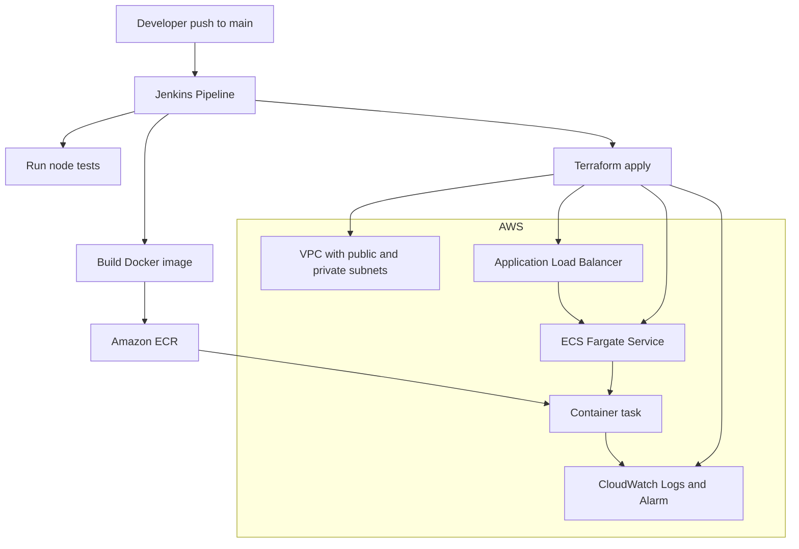

# Architecture Diagram

```mermaid
flowchart TD
    Dev[Developer push to main] --> Jenkins[Jenkins Pipeline]
    Jenkins --> Test[Run node tests]
    Jenkins --> Build[Build Docker image]
    Build --> ECR[Amazon ECR]
    Jenkins --> TF[Terraform apply]

    subgraph AWS
      ALB[Application Load Balancer]
      ECS[ECS Fargate Service]
      Task[Container task]
      CW[CloudWatch Logs and Alarm]
      VPC[VPC with public and private subnets]
    end

    TF --> VPC
    TF --> ALB
    TF --> ECS
    TF --> CW
    ECR --> Task
    ALB --> ECS
    ECS --> Task
    Task --> CW
```
